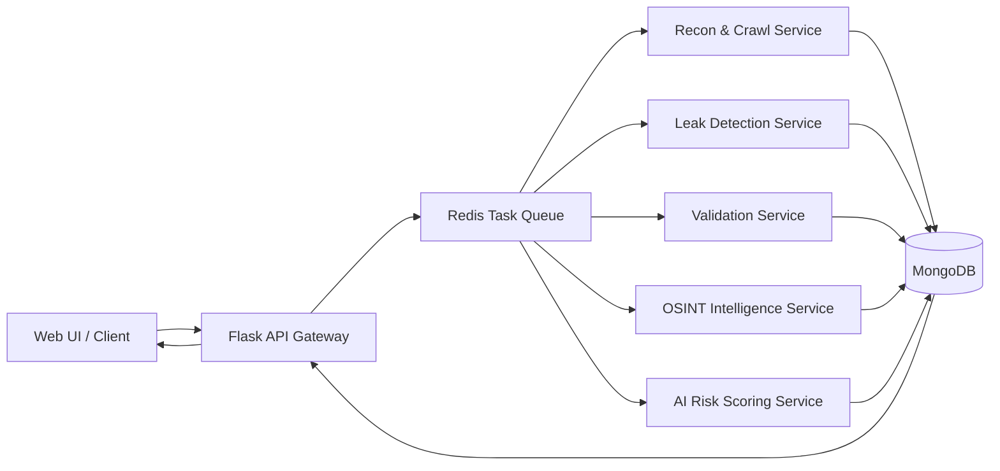

# 🦅 Sentrix – Sensitive Exposure & Threat Intelligence System

> **Automated Data Leak Detection and Risk Intelligence Platform**


---

## 🚀 Overview

**Sentrix** is a modular cybersecurity platform designed to automatically detect, analyze, and prioritize sensitive data exposures across web applications and related assets. It bridges the gap between simple pattern-based scanners and full-scale security platforms by combining automation, contextual intelligence, and explainable risk scoring.

---

## 🎯 Problem Statement

Modern applications frequently leak sensitive information such as API keys, tokens, configuration files, and personal data through client-side assets and misconfigurations. Existing tools often rely purely on regex-based detection, producing high false positives, or operate as black-box systems with limited explainability.

---

## 💡 Solution Approach

Sentrix addresses this problem using a **multi-stage intelligence pipeline** that:

1. Discovers exposed attack surfaces automatically  
2. Detects potential leaks using structured and statistical techniques  
3. Validates findings using passive, offline analysis  
4. Enriches results with OSINT-based context  
5. Assigns risk using a hybrid rule-based and ML-driven scoring engine  

The outcome is actionable, explainable intelligence instead of raw alerts.

---

## ✨ Core Modules

### 🕸️ Recon & Crawling Engine
- Discovers reachable endpoints and client-side assets  
- Focuses on inline and external JavaScript sources  
- Prevents infinite loops and scope drift  

---

### 🔍 Leak Detection Engine
- Identifies secrets and sensitive artifacts using:
  - Regex pattern matching  
  - Shannon entropy analysis  
  - Named Entity Recognition (NER) for PII  
- Filters common false positives such as UUIDs and CSS values  

---

### ✅ Validation & Exploitability Analysis
- Performs passive, offline validation  
- Includes:
  - JWT structure and expiry checks  
  - Token entropy and encoding validation  
  - Email domain verification via DNS MX records  

---

### 🌍 OSINT Correlation Engine
- Enriches findings using curated offline OSINT datasets  
- Detects:
  - Breached or high-risk domains  
  - Disposable email providers  
  - Sensitive filenames and misconfigurations  
- No external API calls (privacy-first design)  

---

### 🧠 AI-Based Risk Scoring Engine
- Hybrid approach combining deterministic rules with a RandomForest classifier  
- Input features include:
  - Leak type and context  
  - Validation results  
  - OSINT indicators  
  - Entropy characteristics  
- Outputs:
  - Risk score (0–100)  
  - Severity label (Low / Medium / High)  
- ML decisions are bounded by hard safety rules for explainability  

---

## 🏗️ System Architecture



---

## 🛠️ Tech Stack

- **Backend Framework**: Flask (Python)
- **Task Queue**: Celery
- **Broker & Cache**: Redis
- **Database**: MongoDB (NoSQL)
- **Containerization**: Docker & Docker Compose
- **ML Engine**: Scikit-learn (RandomForest)

---

## ⚠️ Important Setup Notice

Sentrix uses **Google Gemini API** for optional AI-assisted analysis and contextual intelligence.

Before running the project, you must:

1. Create a **Gemini API key** from Google AI Studio  
2. Store the key securely in a `.env` file  

### Environment Configuration

Create a `.env` file in the backend root directory and add:

```env
GEMINI_API_KEY=your_gemini_api_key_here
```

---

## ⚡ Getting Started

### Prerequisites
- Docker & Docker Compose installed.

### Installation

1.  **Clone the repository**:
    ```bash
    git clone https://github.com/SaTyAbHr2005/SENTRIX-Sensitive-Exposure-Threat-Intelligence-System
    cd backend
    ```

2.  **Start the Engine**:
    ```bash
    docker-compose up --build -d
    ```

3.  **Verify Status**:
    The Project will be available at `http://localhost:5000/api/ui`.

## 🔌 API Reference

### 🟢 Start a Scan
`POST /api/start_scan`
```json
{
  "url": "https://example.com",
  "created_by": "cli_user"
}
```

### 🔵 Get Statistics
`GET /api/stats`
Returns system-wide metrics, risk distribution, and top leak categories.

### 🟡 Get Scan Results
`GET /api/leaks/<task_id>`
Returns enriched findings with Risk Scores (0-100), ML Analysis, and OSINT labels.

---

## 🤝 Contributing

Contributions are welcome! Please open an issue or submit a PR for any new features or bug fixes.
